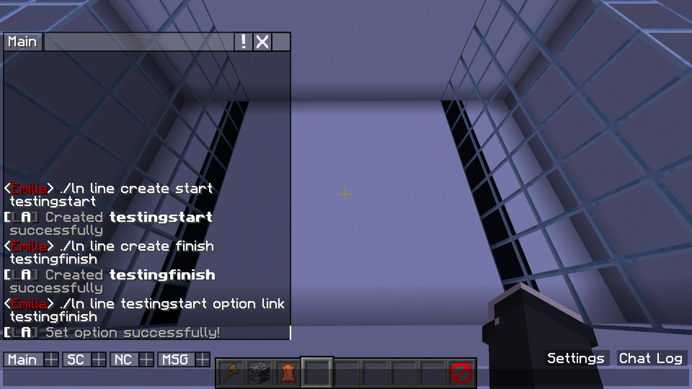
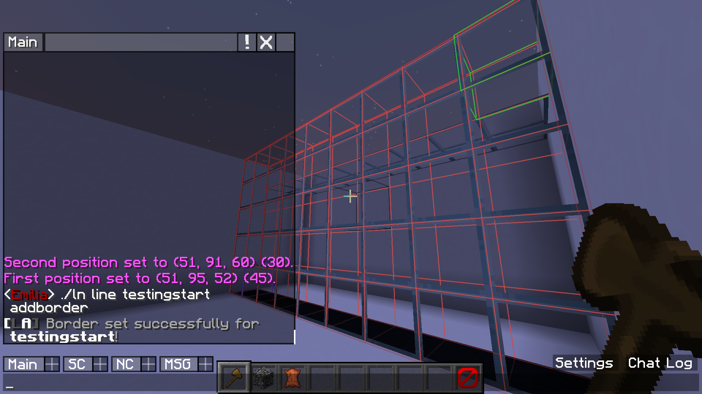
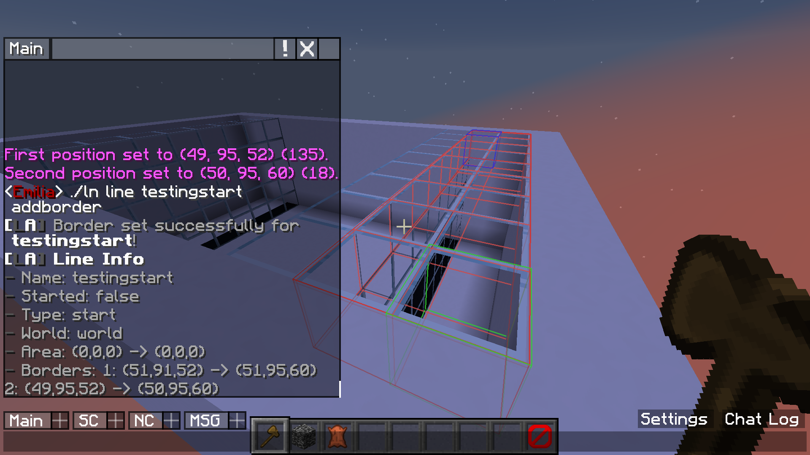
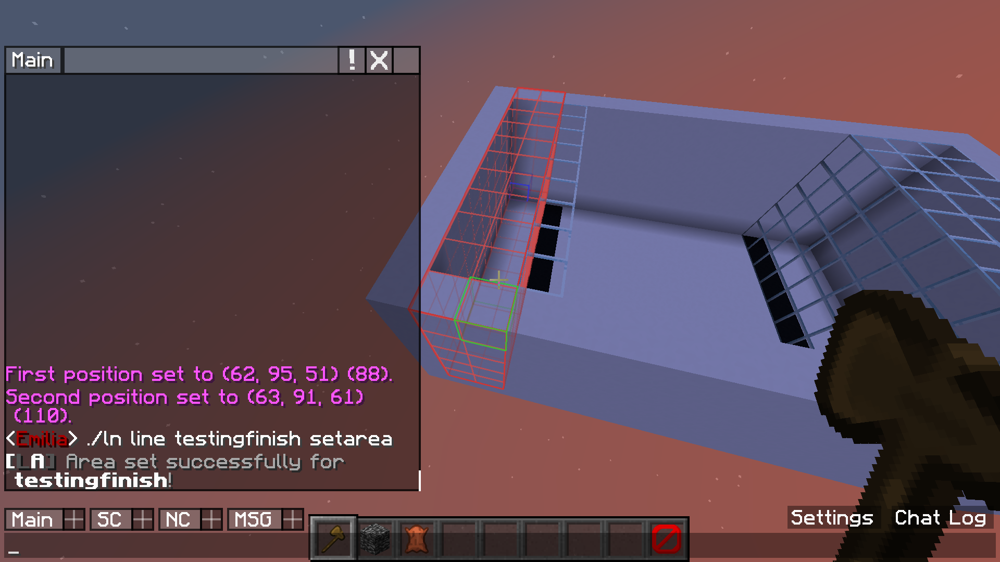

# Lineation

## About
Lineation is a plugin for Spigot Minecraft servers that can create lines for minigames. This can make hosting events with contests for race minigames easier to manage.  
Start lines can contain players until a countdown reaches zero and they are allowed to start. The finish line then counts for players passing it and can close the lines after a certain amount of people win.  

## Purpose
This plugin was written as a replacement to a current approach using command blocks for start and finish lines on a Minecraft server. Lineation makes it easier to manage lines and allows staff to create lines without having to give them access to command blocks. Since we use these to host events with contests and giveaways, this plugin has a feature to only allow players to win a certain amount of times, after that they are ignored by the finish line. 

## Note
This is my first time creating a Minecraft plugin, so feedback is greatly appreciated!   
Huge thanks to [@jeremynoesen](https://github.com/jeremynoesen) for helping a great amount with the code, creating the plugin logo and allowing me to inspect and take inspiration from his earlier Minecraft plugins. 

## Basic Example
  |  
--- | ---
Step 1 | Step 2
First I create a start and finish line  And then I link these two together  So they start and stop at the same time | I then set the first border for this start line
 | 
Step 3 | Step 4
I then define a second border for the start line  This way the players can not jump over the line | I then set an area for this start line In start lines this is only for sending the messages So I make this area big to include potential spectators
 | 
Step 5 | Step 6
I now set a border for the finish line | And finally, I set an area for the finish line too In finish lines this is the area used to detect players
 |   

It's all set up now! See the GIF underneath for a demonstration of what I just set up in action.

## Usage

### Commands

##### Global commands
 - `/lineation help` - Show global commands  
 - `/lineation help lines` - Shows commands relating to lines  
 - `/lineation help options` - Shows more advanced options for lines  
 - `/lineation config reload` - Saves and reloads config files  
 - `/lineation config maxwins <number>` - Sets the maximum amount of times someone can win  
 - `/lineation config forget <uuid/username>` - Forgets a players wins for maxwins  
 - `/lineation line create <type> <name>` - Create a line with a specified type and name  
 - `/lineation line remove <name>` - Remove a line by name
 - `/lineation line list <type>` - Lists all lines, type is optional
##### Line specific commands
 - `/lineation line <name> info` - Gets information about specified line  
 - `/lineation line <name> start` - Starts and opens this line  
 - `/lineation line <name> stop` - Stops and closes this line  
 - `/lineation line <name> setarea` - Sets the detection area for this line using your current WorldEdit selection  
 (This sets the detection area used to send the countdown for start lines and to count players for finish lines)  
 - `/lineation line <name> addborder` - Adds a border to set blocks at for this line using your current WorldEdit selection  
 (This adds a border which is used to set blocks with WorldEdit)  
 - `/lineation line <name> getwinners` - Gets the last winners of this line (Finish type only)  
##### Line options
 - `/lineation line <name> option blocksequence <block1,block2,block3...>` - Comma seperated list of blocks to use for the opening sequence  
 (The first block is used when stopped. Only one is required. For every block added the countdown takes one second longer.)  
 - `/lineation line <name> option teleport <here/disable>` - Makes players teleport to this current location when they finish  
 - `/lineation line <name> option maxwinners <number>` - Number of players that have to finish before the line closes  
 - `/lineation line <name> option messagereach <all/world/disabled>` - Sets who the announcement messages will target  
 - `/ineation line <name> option gamemodes <survival,adventure>` - Comma seperated list of gamemodes players have to be in to be counted  
 - `/lineation line <name> option link <line name>` - This links a line of the other type to automatically start or stop at the same time  

### Permissions
 - `lineation.help` - Allow using the help commands  
 - `lineation.reload` - Allow reloading the plugin config files  
 - `lineation.maxwins` - Allow setting maxwins  
 - `lineation.forget` - Allow forgetting a players wins  
 - `lineation.line.list` - Allow seeing the list of lines  
 - `lineation.line.create` - Allow creating new lines  
 - `lineation.line.remove` - Allow removing lines  
 - `lineation.line.setarea` - Allow setting the area for a line  
 - `lineation.line.addborder` - Allow adding borders for a line  
 - `lineation.line.removeborder` - Allow removing borders for a line  
 - `lineation.line.start` - Allow starting lines  
 - `lineation.line.stop` - Allow stopping lines  
 - `lineation.line.option.blocksequence` - Allow setting the block sequence for a line  
 - `lineation.line.option.teleport` - Allow setting a teleport location for a line  
 - `lineation.line.option.maxwinners` - Allow setting the max winners for a line  
 - `lineation.line.option.messagereach` - Allow setting the reach for the announcement messages  
 - `lineation.line.option.gamemodes` - Allow setting the allowed gamemodes for a line  
 - `lineation.line.option.link` - Allows linking lines  

## Installation
To install Lineation, download the latest release and place the JAR file in your server plugins folder and restart your server. This will create the necessary files with the default options in `plugins/Lineation`.  

This plugin also has WorldEdit as a dependency, so please install that too. WorldEdit is used to make selections and set the blocks of the finish line.  

The plugin has been tested in Minecraft 1.16.5 using Java 16 with WorldEdit 7.2.0. It might work on older versions, but I will not be guaranteeing compatability with older versions.  

## Configuration
Most of the configuration is done ingame by using the /lineation command. You can however edit config.yml to set lines default options, for if you find the provided defaults are not fit.  
Please do not edit lines.yml by hand, this will likely break and I will offer no support for this. This plugin overwrites config files when it reloads/stops, so do not edit files with the server running.

