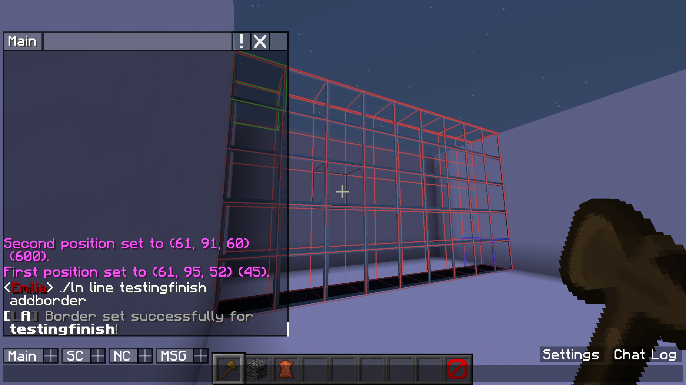

# Lineation

## About

Lineation is a plugin for Spigot Minecraft servers that can create lines for minigames. This can make hosting events with contests for racing minigames easier to manage.  
Start lines can contain players until a countdown reaches zero and they are allowed to start. While the race is on, the finish line counts for players passing it and can close the lines after a certain amount of people win.  

## Purpose

This plugin was written as a replacement to a current approach using command blocks for start and finish lines during player races on a Minecraft server. Lineation makes it easier to manage lines, track winners of races and allows staff to create lines without having to give them access to command blocks. Since we use these to host events with contests and giveaways, this plugin has a feature to only allow players to win a certain amount of times, after that they are ignored by the finish line. 

## Note

This is my first time creating a Minecraft plugin, so feedback is greatly appreciated!   
Huge thanks to [@jeremynoesen](https://github.com/jeremynoesen) for helping a great amount with the code, creating the plugin logo and allowing me to inspect and take inspiration from his earlier Minecraft plugins. 

## Basic Example

|                                                                                                                        |                                                                                                                                           |
| ------------------------------------------------------------------------------------------------------------------------- | -------------------------------------------------------------------------------------------------------------------------------------------- |
| Step 1                                                                                                                    | Step 2                                                                                                                                       |
| First I create a start and finish line  And then I link these two together  So they start and stop at the same time | I then set the first border for this start line                                                                                              |
|                                                                                                    |                                                                                                                       |
| Step 3                                                                                                                    | Step 4                                                                                                                                       |
| I then define a second border for the start line  This way the players can not jump over the line                      | I then set an area for this start line In start lines this is used to send the announcement messages, target players to teleport and more |
|                                                                                                    |                                                                                                                       |
| Step 5                                                                                                                    | Step 6                                                                                                                                       |
| I now set a border for the finish line                                                                                    | And finally, I set an area for the finish line too In finish lines this is the area used to detect players                                |
|                                                                                                    |                                                                                                                       |

It's all set up now! See the GIF underneath for a demonstration of what I just set up in action.

See more examples on the [Wiki](https://diademiemi.github.io/Lineation/wiki/index.html)  

## Usage

### Commands

Not all commands are listed here, to view all commands, check the [wiki page](https://diademiemi.github.io/Lineation/wiki/commands.html)  

#### General Commands

-  `/lineation help` :   
   Show this page  

- `/lineation help lines` :  
   View commands relating to lines

-  `/lineation line create <start/finish> <name>` :  
   Creates a start or finish line with this name  

-  `/lineation line remove <name>` :  
   Deletes a line with this name  

-  `/lineation line list <start/finish/started>`:  
   Lists all lines that are defined. Specifying a type is optional

#### Line Commands

-  `/lineation line <name> start` :  
   Starts this line, opens borders if there are any  

- `/lineation line <name> stop` :  
   Stops this line, closes borders if there are any  

- ` /lineation line <name> setarea` :  
   Sets the area where players will be detected  

-  `/lineation line <name> addborder` :  
   Adds a border where blocks will be set at your current WorldEdit selection  

-  `/lineation line <name> removeborder <number/all>` :  
   Remove a border by number  

-  `/lineation line <name> link <name>` :  
   Link this line with a different line with the opposite type. This makes them start/stop at the same time.  

-  `/lineation line <name> tp` :  
   Teleports you to this lines teleport point  
   View /lineation line <name> info to see this information from a line

-  `/lineation line <name> addcheckpoint` :  
   Adds a checkpoint, players have to cross through these in order before winning  

-  `/lineation line <name> removecheckpoint <number/all>` :  
   Remove a checkpoint by number

### Permissions

- `lineation.help` - Allow using the help commands  
- `lineation.config.reload` - Allow reloading the plugin config files  
- `lineation.config.maxwins` - Allow setting the maximum amount of times someone can win  
- `lineation.config.forget` - Allow forgetting a players wins  
- `lineation.line.list` - Allow seeing the list of lines  
- `lineation.line.here` - Allow seeing information about the line you're currently standing in
- `lineation.line.create` - Allow creating new lines  
- `lineation.line.remove` - Allow removing lines  
- `lineation.line.setarea` - Allow setting the area for a line  
- `lineation.line.addborder` - Allow adding borders for a line  
- `lineation.line.removeborder` - Allow removing borders for a line  
- `lineation.line.addcheckpoint` - Allow adding checkpoints for a line  
- `lineation.line.removecheckpoint` - Allow removing checkpoints for a line  
- `lineation.line.tp` - Allow teleporting to a lines teleport point
- `lineation.line.start` - Allow starting lines  
- `lineation.line.stop` - Allow stopping lines  
- `lineation.line.link` - Allows linking lines
- `lineation.line.option.blocksequence` - Allow setting the block sequence for a line  
- `lineation.line.option.teleport` - Allow setting a teleport location for a line  
- `lineation.line.option.maxwinners` - Allow setting the max winners for a line  
- `lineation.line.option.addcommand` - Allow adding commands to run at finish  
- `lineation.line.option.removecommand` - Allow removing command to run  
- `lineation.line.option.laps` - Allow setting the laps for a line  
- `lineation.line.option.messagereach` - Allow setting the reach for the announcement messages  
- `lineation.line.option.gamemodes` - Allow setting the allowed gamemodes for a line  
- `lineation.line.option.illegalarea` - Allows using the illegal area option
- `lineation.line.option.illegalarea.add` - Allow adding illegal areas to a line
- `lineation.line.option.illegalarea.remove` - Allow removing set illegal areas

## Installation

To install Lineation, download the latest release and place the JAR file in your server plugins folder and restart your server. This will create the necessary files with the default options in `plugins/Lineation`.  

This plugin also has WorldEdit as a dependency, so please install that too. WorldEdit is used to make selections and set the blocks of the finish line.  

The plugin has been tested on Minecraft 1.13.2 using Java 11 and Minecraft 1.16.4 and 1.17.1 using Java 16 with WorldEdit 7.2.0.

## Configuration

Most of the configuration is done ingame by using the `/lineation command`. You can however edit `config.yml` to set lines default options, for if you find the provided defaults are not fit.  
Please do not edit `lines.yml` by hand, this will likely break and I will offer no support for this. This plugin overwrites config files when it reloads/stops, so do not edit files with the server running.

## Links

[Javadoc](https://diademiemi.github.io/Lineation/javadoc/)  
[Wiki](https://diademiemi.github.io/Lineation/wiki/index.html)  

  
## Notice
Development of this plugin has been frozen. Functionality of this plugin will be moved to my ongoing project [Dopamine](https://github.com/diademiemi/Dopamine)
