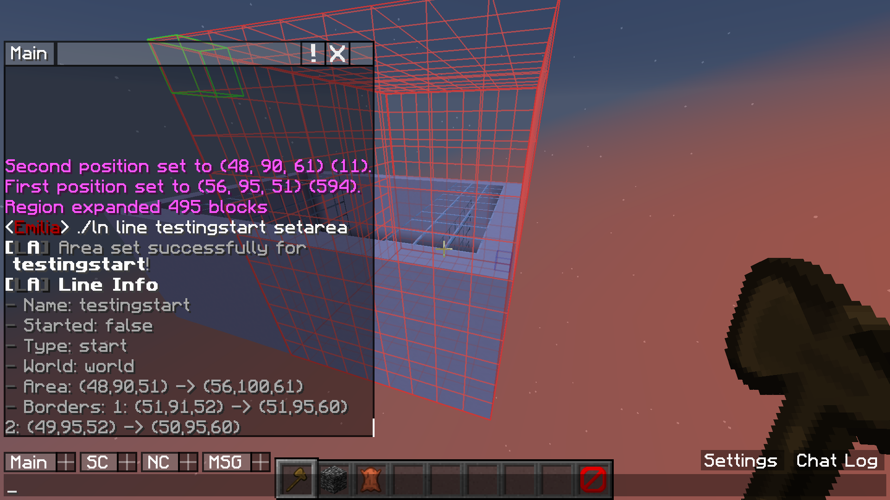
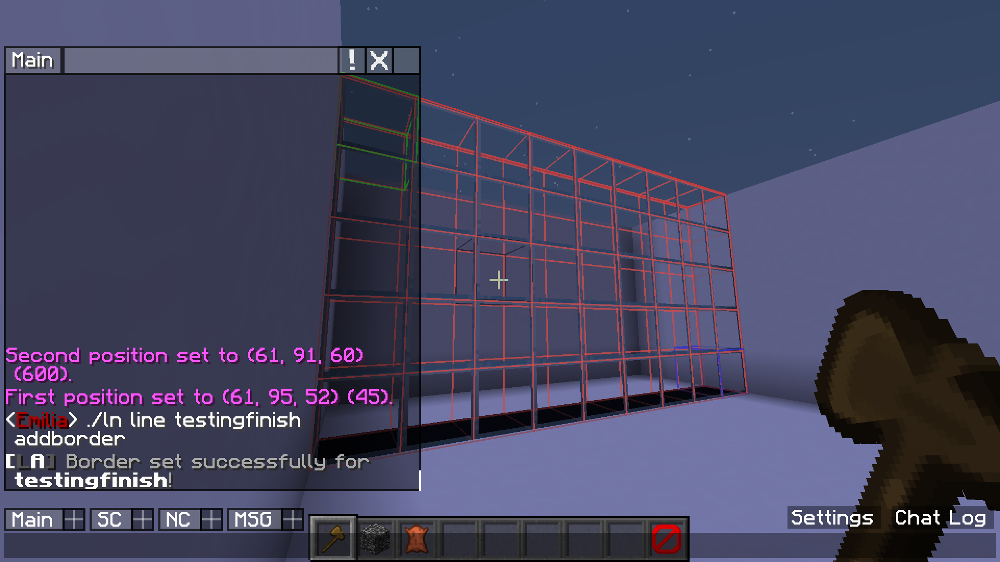
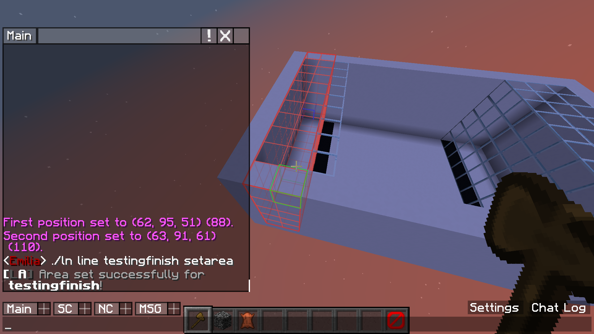

# Demo

  |  
--- | ---
Step 1 | Step 2
First I create a start and finish line  And then I link these two together  So they start and stop at the same time | I then set the first border for this start line
 | 
Step 3 | Step 4
I then define a second border for the start line  This way the players can not jump over the line | I then set an area for this start line In start lines this is only for sending the messages So I make this area big to include potential spectators
 | 
Step 5 | Step 6
I now set a border for the finish line | And finally, I set an area for the finish line too In finish lines this is the area used to detect players
 |   

It's all set up now! See the GIF underneath for a demonstration of what I just set up in action.

