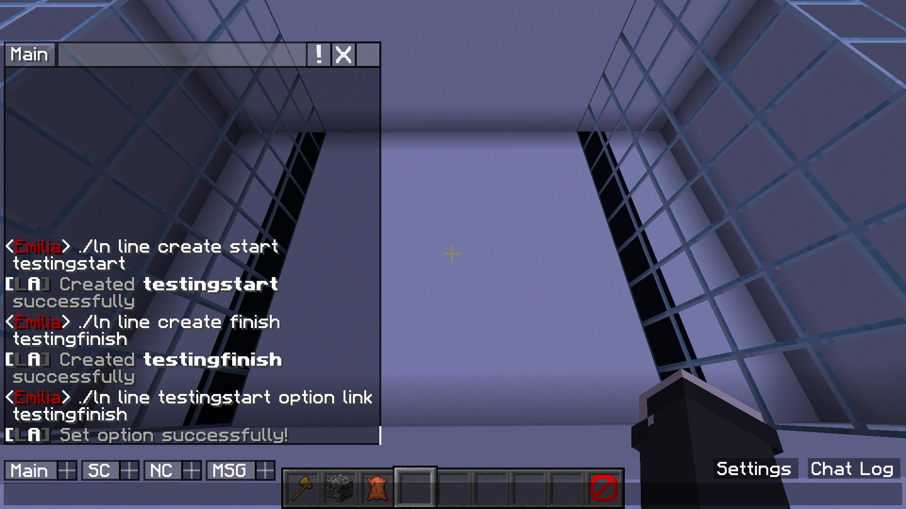
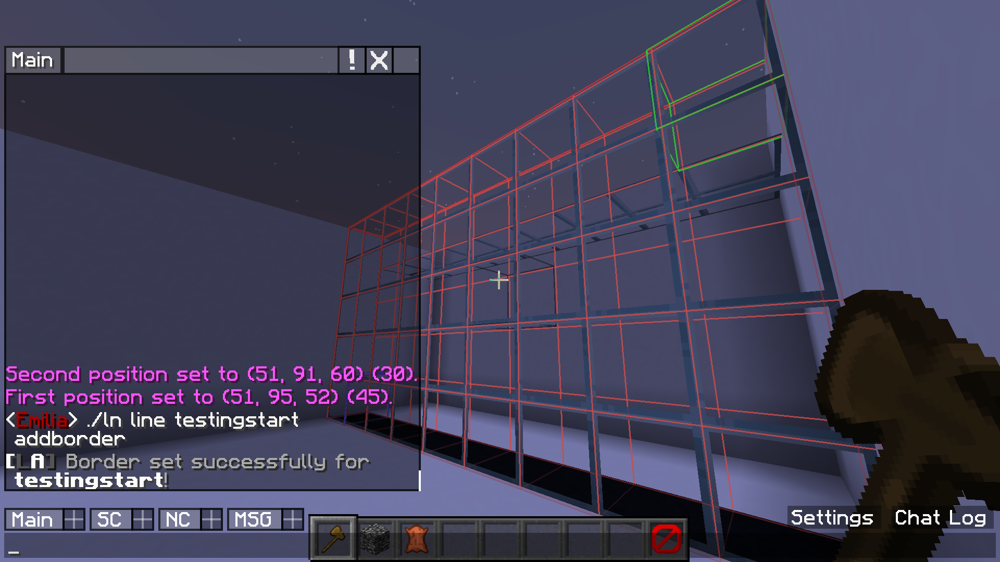
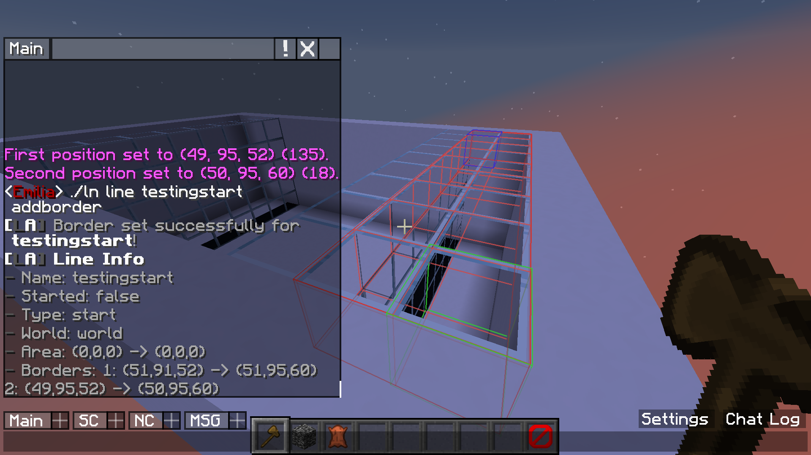
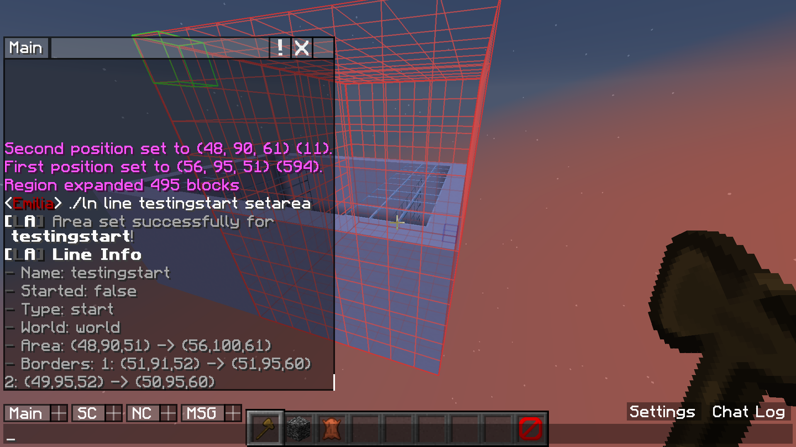
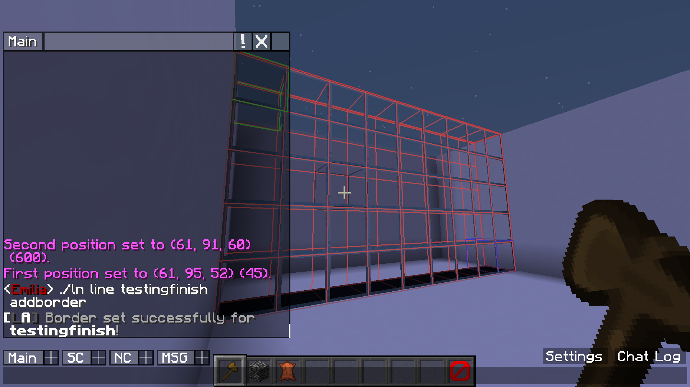

# Basic Setup

### Step 1  
First I create a start and finish line and link these two together so they start and stop at the same time  
  

### Step 2
I then set the first border for this start line  
  

### Step 3
I then define a second border for the start line  
This way the players can not jump over the line  
  

### Step 4
I then set an area for this start line  
In start lines this is only for sending the messages and teleporting players if enabled  
  

### Step 5
I now set a border for the finish line  
  

### Step 6
And finally, I set an area for the finish line too  
In finish lines this is the area used to detect players  
  

It's all set up now! See the GIF underneath for a demonstration of what I just set up in action.  

  

[Back to index](../index.html)  
