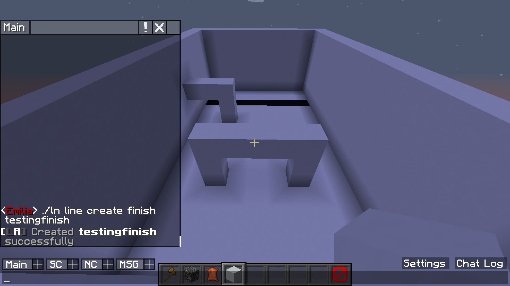
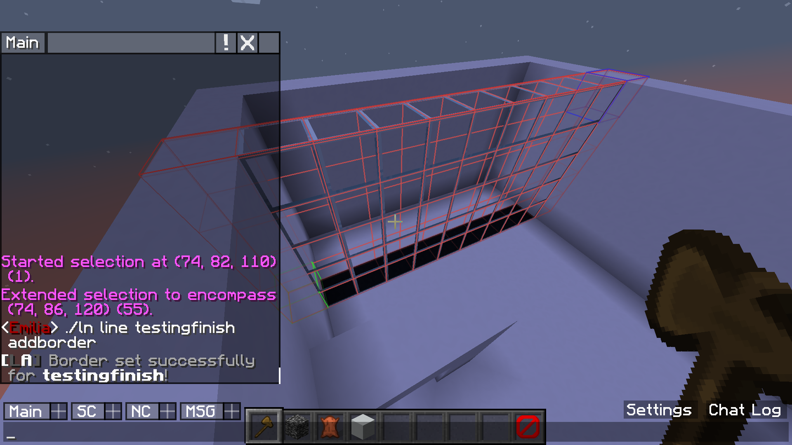
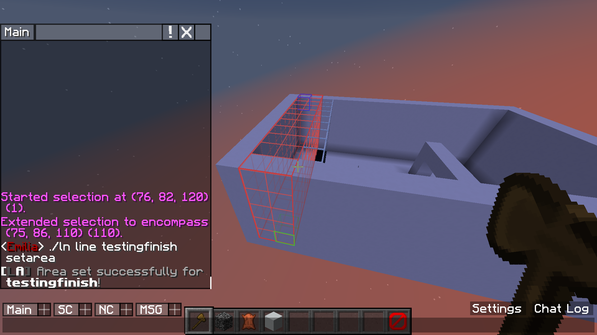
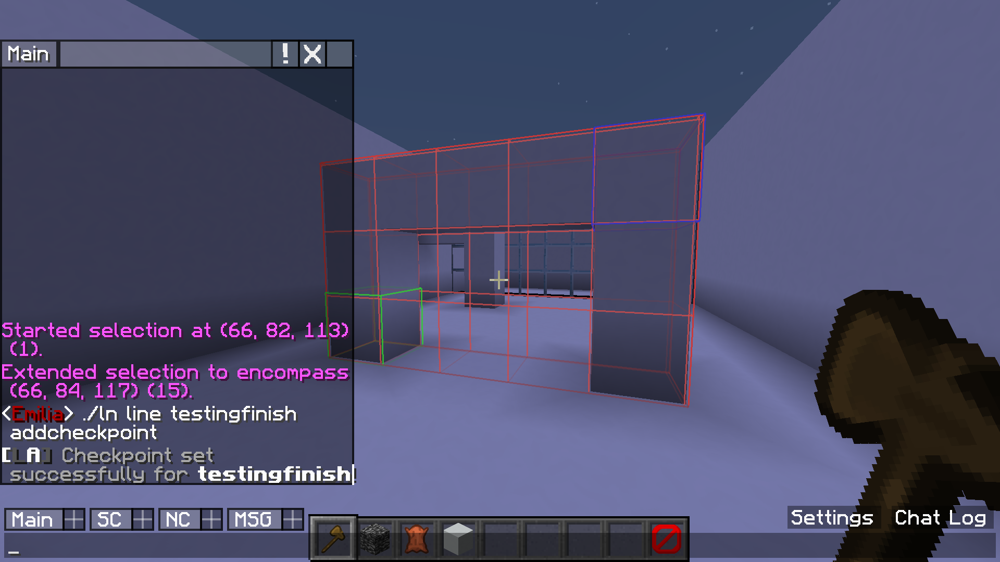
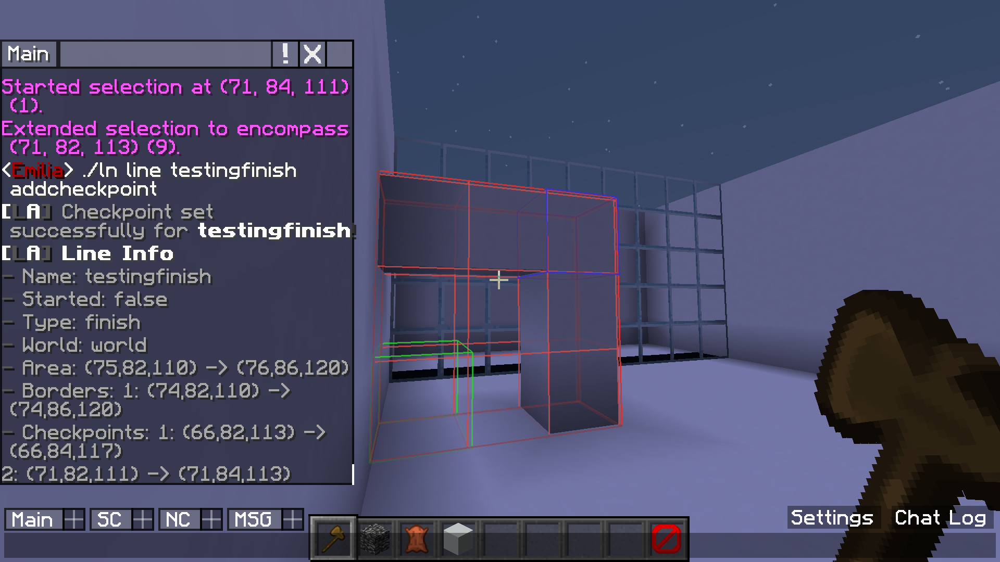

# Basic Setup

### Step 1  
First I create a finish line called testingfinish  
  

### Step 2
I then set a border for this line  
  

### Step 3
Here I define the area for this line  
  

### Step 4
I now set a first checkpoint for this line. Players will have to go through this before going through the second checkpoint  
  

### Step 5
Here I define a second checkpoint. Players will have to go through these checkpoints in order before finishing  
  

It's all set up now! See the GIF underneath for a players view of what I just set up.  

  

[Back to index](../index.html)  
