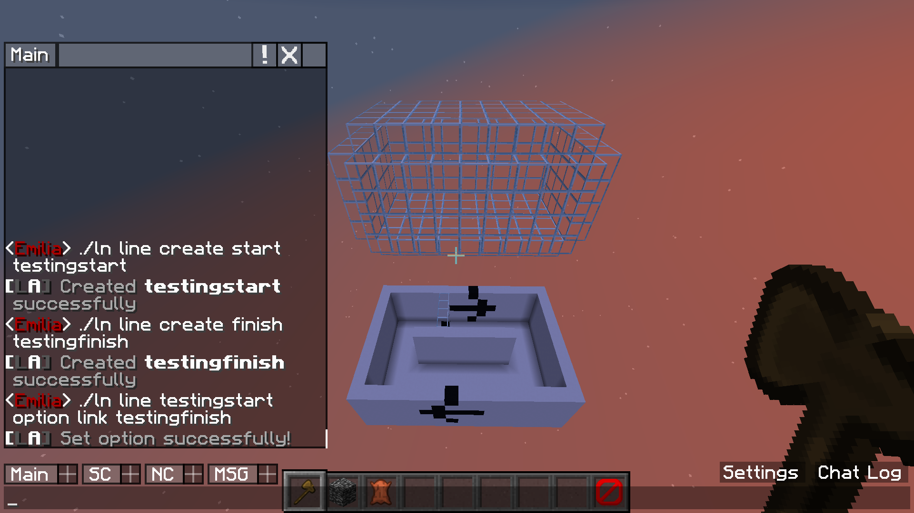
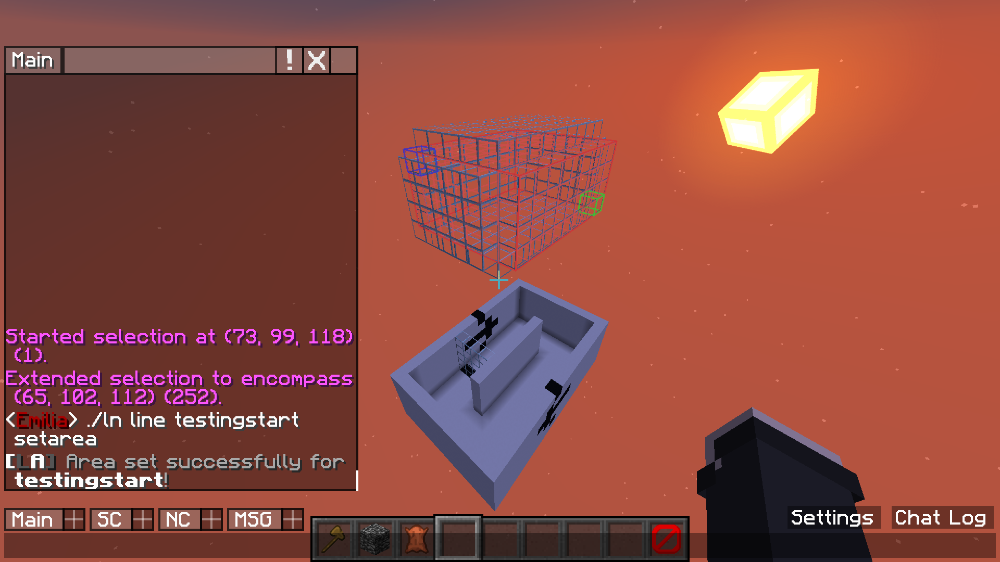
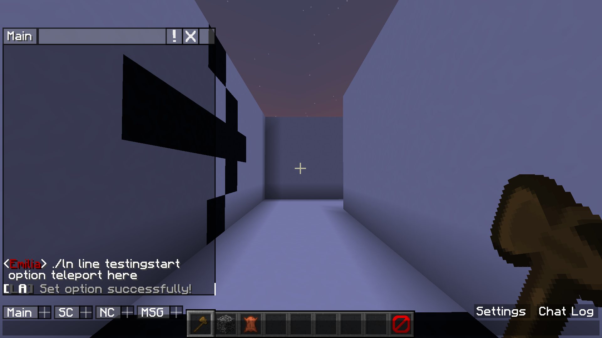
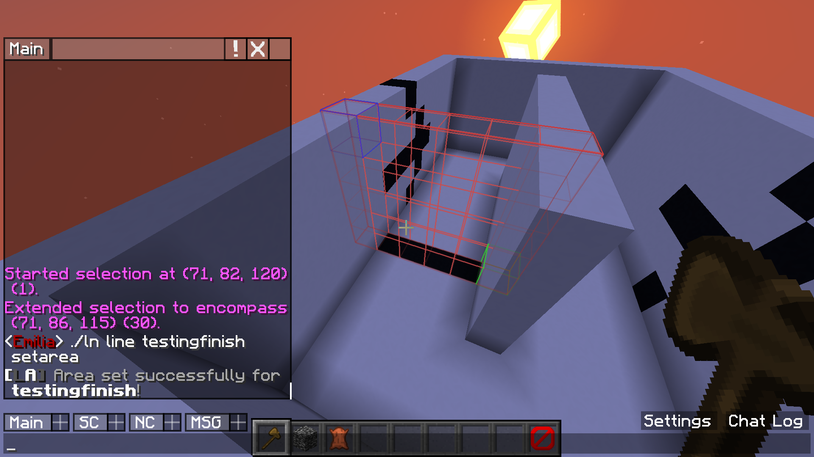
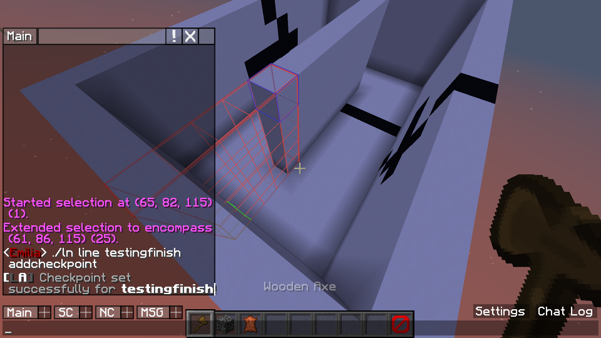
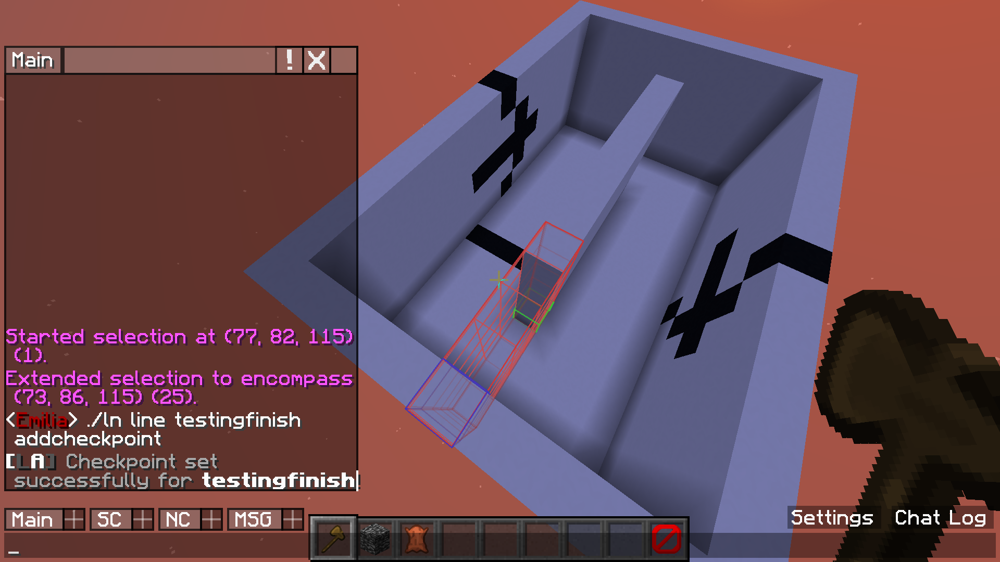
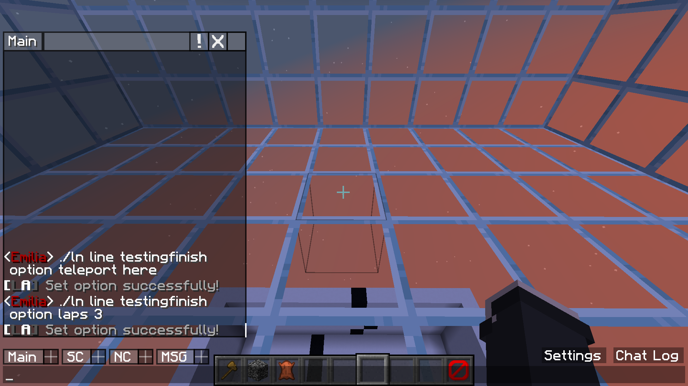

# Multiple Laps

### Step 1  
First I create a start and finish line and link these two together so they start and stop at the same time  
  

### Step 2
I then set the area for this start line  
  

### Step 3
I then set the teleport option for this start line, then after the countdown it will teleport players here.  
  

### Step 4
I then set an area for the finish line  
This is what players will have to pass through to win  
  

### Step 5
I now set the first checkpoint for the finish line  
Players will have to pass throug this checkpoint before being counted to win  
  

### Step 6
Now I set a second checkpoint, this makes sure that players can't go backwards, as it will subtract the checkpoint.  
  

### Step 7
I now set a teleport point inside the glass dome for the finish line. This means that when a player finishes, they get teleported back off the course.  
I also set the laps option to 3, this means players have to do 3 laps before winning.  
  

It's all set up now! See the GIF underneath for a players view of what I just set up.  

  

[Back to index](../index.html)  
